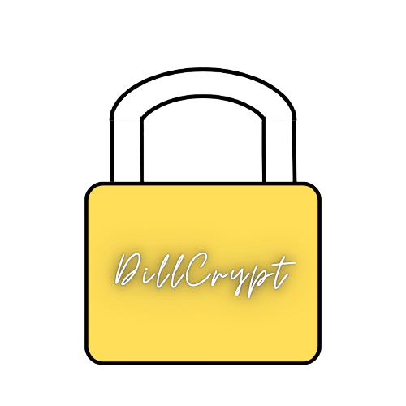

  
  <h1>DillCrypt</h1>
  

    <i>A simple, file encryption tool with immersive UI/UX and it's free.</i>
  

  

    
    
    
    
  

---

## ✨ Key Features

### 🛡️ Core Security

- **Custom Encryption Engine:** Uses a unique, untraceable algorithm instead of easily hackable standard libraries.
- **RAM-Only Preview:** View secret images safely directly in RAM without saving any temporary files to your disk.
- **Steganography:** Hide your encrypted files invisibly inside normal `.jpg` or `.png` images.
- **Secure Shredder:** Permanently delete original files so they can never be recovered by forensics.
- **EXIF Scrubber:** Automatically remove GPS and device tracking data from photos before encryption.
- **Bruteforce Protection:** Automatically locks the app after multiple wrong password attempts.
- **Password Generator:** Create a 16-character military-grade password with a single click.

### 🎨 Next-Gen UI/UX

- **Right-Click Integration:** Encrypt or decrypt instantly right from your Windows File Explorer.
- **Smart JIT Options:** Choose your shredding and metadata options right before processing the file.
- **Acrylic Glass UI:** Beautiful translucent windows that smoothly blend with your desktop background.
- **Matrix Typing Effect:** Cool scrambled hacker-style animation when typing your password.
- **Fluid Progress Bar:** Liquid-style glowing animation while processing files.
- **Interactive Feedback:** The window physically shakes on errors, and glitches when switching to the Hacker theme.
- **Dynamic Accents:** App UI colors and sliders automatically adapt to your selected theme.

---

## 🛠️ Tech Stack

- **Core:** Python 3
- **GUI Framework:** PyQt5
- **Compiler:** Nuitka (C++ Transpilation for ultimate reverse-engineering resistance)

---

## 🚀 Installation & Usage

### For End-Users

The easiest way to use DillCrypt is to download the pre-compiled, standalone executable.

1. Head over to the [Releases](../../releases) page.
2. Download the latest `DillCrypt_vx.x.x.zip`.
3. Extract the folder and run `DillCrypt.exe`. No Python installation required!
